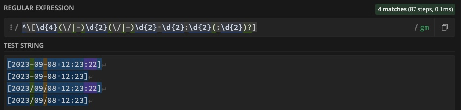
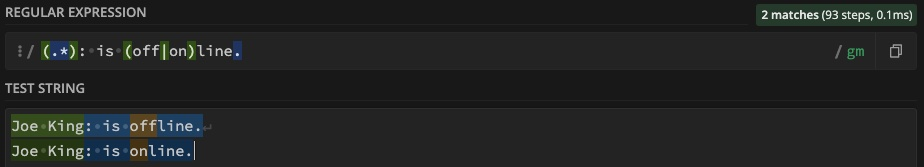
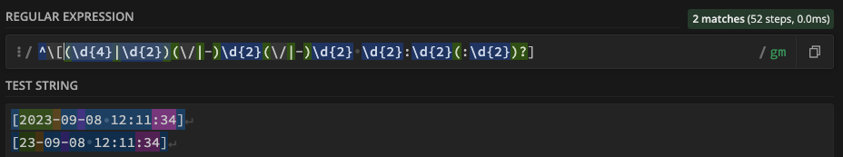
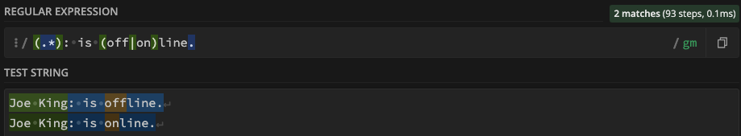
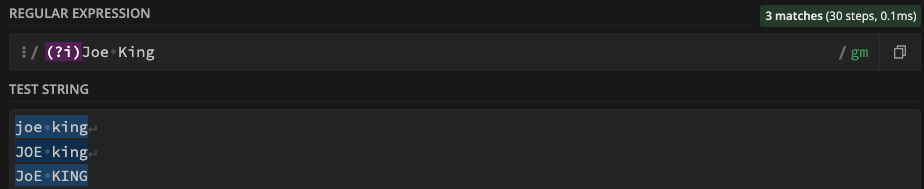
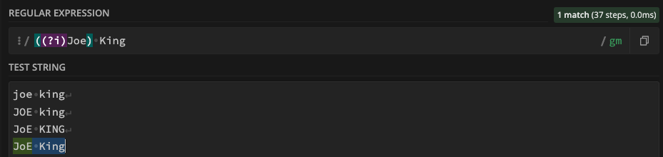
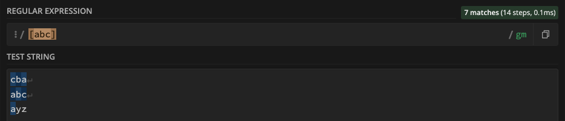
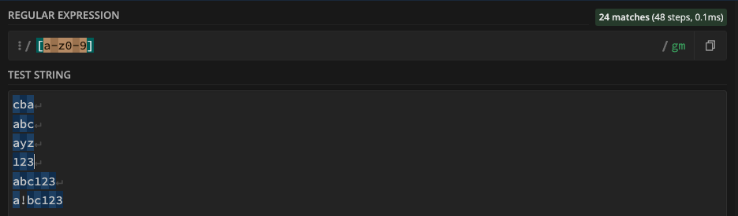
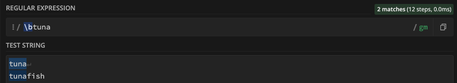

# RegEx Tutorial

In this document, I will go over an example of a regex expression and how I broke it down.

A regex, or "regular expression" is a method how you can match a pattern with a string.  It is meant to serve two main uses: 1. To verify input data (like email address or social security number), and 2. in code, verifying a string matches a specific pattern.

## Summary

In this particulat example, I will be using this regex pattern to verify a line of text in a chat log:

We will have a few examples:

### Example 1: A datetime example:
```
^\[(\d{4}|\d{2})(\/|-)\d{2}(\/|-)\d{2} \d{2}:\d{2}(:\d{2})?]
The above regex denotes a string in the file which will look like this:
[2023-09-08 12:33:10]
```
### Example 2: A parsing of a display and user name:
```
.*?\((.*)\):

The above regex parses a display name (Joe King) and optionally user name (joeking).  The string looks like this:

Joe King (joeking)
```
### Example 3: Simple parsing if a user is online or offline:
```
(.*): is (off|on)line.

The above is looking for a specific string whether a user has logged on or off, saying this isn't relevant to chat itself.

The string looks like this:
Joe King (joeking): is offline.
```
> I will be denoting the example in each of the below sections and how I use them.

## Table of Contents

- [Anchors](#anchors)
- [Quantifiers](#quantifiers)
- [OR Operator](#or-operator)
- [Character Classes](#character-classes)
- [Flags](#flags)
- [Grouping and Capturing](#grouping-and-capturing)
- [Bracket Expressions](#bracket-expressions)
- [Greedy and Lazy Match](#greedy-and-lazy-match)
- [Boundaries](#boundaries)
- [Back-references](#back-references)
- [Look-ahead and Look-behind](#look-ahead-and-look-behind)

## Regex Components

### Anchors

An anchor simply begins and ends a regular expression.  They aren't part of the string matching class, but define positions before, after, before and after, or even between characters.

In example 1: The ^ symbol represents the start.  The lack of a $ to end denotes the regex anchor ends at the end.



> Examples 2 and 3 do not have anchors and are not required.



### Quantifiers

The quantifier states a count of qualifying characters or substrings must exist in order to make a match.

In example 1, the "\d{4}" means that we MUST have a 4 digit year.

So, 2023 is a match, but 23 would not be as it requires 4 digits.

### OR Operator

To build on the last section, the OR operator is separated by a pipe ("|") character.

If I wanted to do 2 or 4 digit years as in the past example, the following regex grouping would provide a match either way:

(\d{4}|\d{2})

So either a 4 or 2 year date would be accepted: 



Same with Example 3, where it shows a user going ON line or OFF line.

(.*): is (off|on)line.



### Character Classes

A character class is a data type, as in the previous examples, we used a digit or \d, the "d" represents a digit (0..9) and is escaped by the backslash so that it is not interpreted for a literal "d" character.

### Flags

None of these are used in my examples, so I will drop one here.

Flags are a way to add paramerers into your search.  I will use a case insensitive search as an example.

To do a case insensitive search, use the (?i) before the text you are searching.  For example, the name Joe King in this search is case insensitive, so all 3 of these tests pass.



I can use grouping to ensure that only say, "Joe" is case insensitive.



> Note that only the last string was a match, the other 3 from previous were not.

### Grouping and Capturing

We have used grouping extensively already in this exercise.  Grouping is done inside parenthesis and can be combined with other functions like "OR".

```
Example 1 uses 2 groupings right from the beginning:

^\[(\d{4}|\d{2})(\/|-)\d{2}(\/|-)\d{2} \d{2}:\d{2}(:\d{2})?]

(\d{4}|\d{2}) combines looking for digits, but requiring either 4 or 2 depending on year type.

(\/|-) separates the date string with a / or - and the \ exists as an escape for the / character so it can be used as a string lieteral.
```

### Bracket Expressions

Bracket references are intended to match specific characters, either a range of or specific characters.  It can also be used the reverse, and use a "not" clause as well.  These are not used in my examples, but will drop one here.

The example [abc] will only match characters a, b, or c in any order.


In the above,7 matches because the "yz" in the last string did not meet the pattern requirements.

Changing this to [a-z0-9], we can do letters or numbers.


Note in the above 24 of 25 characters matched.  The exclamation point was not included in the bracket expression.

### Greedy and Lazy Match

Not used in my examples, greedy and lazy match have one stark difference.

A greedy match will look for as many matches as possible.

A lazy match will look for as few qualified matches as possible to fulfill the requirements.

### Boundaries

Not used in my examples, but a boundary (\b) is looking for specific word patters.

It can be used to find a specific word (by a \b on both ends), or beginning or substring of a word.

Examples:
\btuna will find tuna and tunafish



### Back-references

### Look-ahead and Look-behind

## Author

A short section about the author with a link to the author's GitHub profile (replace with your information and a link to your profile)
