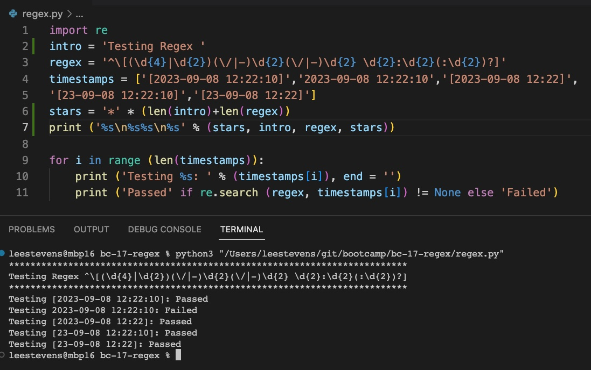

# RegEx Tutorial

In this document, I will go over an example of a regex expression and how I broke it down.

A regex, or "regular expression" is a method how you can match a pattern with a string.  It is meant to serve two main uses: 1. To verify input data (like email address or social security number), and 2. in code, verifying a string matches a specific pattern.

## Table of Contents

- [Summary](#summary)
- [Anchors](#anchors)
- [Quantifiers](#quantifiers)
- [OR Operator](#or-operator)
- [Character Classes](#character-classes)
- [Flags](#flags)
- [Grouping and Capturing](#grouping-and-capturing)
- [Bracket Expressions](#bracket-expressions)
- [Greedy and Lazy Match](#greedy-and-lazy-match)
- [Boundaries](#boundaries)
- [Back-references](#back-references)
- [Look-ahead and Look-behind](#look-ahead-and-look-behind)
- [Examples in JavaScript and Python](#bonus-code)

# Summary

In this particulat example, I will be using this regex pattern to verify a line of text in a chat log.  This log file contains a variety of types of data.

## As a bonus
> I will be adding JavaScript and Python code at the end to demonstrate and test the regex that is being presented at no additional charge to you.

We will use 2 examples from this data:

### Example 1: A datetime example:
```
^\[(\d{4}|\d{2})(\/|-)\d{2}(\/|-)\d{2} \d{2}:\d{2}(:\d{2})?]
```
The above regex denotes a string in the file which will look like the following:
```
[Year-Month-Day Hour:Minute:Second]
[2023-09-08 12:22:10]
[2023-09-08 12:22]
[23-09-08 12:22:10]
[23-09-08 12:22]
```

### Example 2: Simple parsing if a user is online or offline:
```
(.*): is (off|on)line.
```
The above is looking for a specific string after the ```:``` whether a user has logged on or off.  The use case for this would be if you find this line, to process it differently than others.

The string looks like this:

```Joe King (joeking): is offline.```

> I will be denoting the example in each of the below sections and how I used them.

## Regex Components

### Anchors

An anchor simply begins and ends a regular expression.  They aren't part of the string matching class, but define positions before, after, before and after, or even between characters.

In example 1: The ```^``` symbol represents the start.  The lack of a ```$``` to end denotes the regex anchor ends at the end.


> Example 2 does not have anchors and is not required.


### Quantifiers

The quantifier states a count of qualifying characters or substrings must exist in order to make a match.

In example 1, the ```\d{4}``` means that we MUST have a 4 digit year.

So, 2023 is a match, but 23 would not be as it requires 4 digits.

### OR Operator

To build on the last section, the OR operator is separated by a pipe ```|``` character.

If I wanted to do 2 or 4 digit years as in the past example, the following regex grouping would provide a match either way:

```(\d{4}|\d{2})```

So either a 4 or 2 year date would be accepted: 


Same with Example 2, where it shows a user going ON line or OFF line.

```(.*): is (off|on)line.```


### Character Classes

A character class is a data type, as in the previous examples, we used a digit or ```\d```, the ```"d"``` represents a digit (0..9) and is escaped by the backslash so that it is not interpreted for a literal ```"d"``` character.

### Flags

None of these are used in my examples, so I will drop one here.

Flags are a way to add paramerers into your search.  I will use a case insensitive search as an example.

To do a case insensitive search, use the ```(?i)``` before the text you are searching.  For example, the name ```Joe King``` in this search is case insensitive, so all 3 of these tests pass.


I can use grouping to ensure that only say, ```"Joe"``` is case insensitive.


> Note that only the last string was a match, the other 3 from previous were not.

### Grouping and Capturing

We have used grouping extensively already in this exercise.  Grouping is done inside parenthesis and can be combined with other functions like "OR".

Example 1 uses 2 groupings right from the beginning:
```
^\[(\d{4}|\d{2})(\/|-)\d{2}(\/|-)\d{2} \d{2}:\d{2}(:\d{2})?]
```
```(\d{4}|\d{2})``` combines looking for digits, but requiring either 4 or 2 depending on year type.

> I also made the trailing grouping ```(:\d{2})?``` optional with the ```?``` after the last ```(:\d{2})``` in case the regex didn't contain the seconds at the end and stopped at minutes.

```(\/|-)``` separates the date string with a ```/``` or ```-``` and the ```\``` exists as an escape for the / character so it can be used as a string literal.

Example 2 uses a grouping in the beginning to match any text before the ```:``` character in the string.  What matters is the is ```(on|off)line``` part of the string.

```(.*): is (off|on)line.```

The ```.*``` is match any string until the grouping ends at literal character map ```":"``` and then the rest of the regex match continues.

### Bracket Expressions

Bracket references are intended to match specific characters, either a range of or specific characters.  It can also be used the reverse, and use a "not" clause as well.  These are not used in my examples, but will drop one here.

The example ```[abc]``` will only match characters ```a, b, or c``` in any order.


In the above, 7 of 9 characters match because the ```"yz"``` in the last string did not meet the pattern requirements.

Changing this to ```[a-z0-9]```, we can do letters or numbers.


Note in the above 24 of 25 characters matched.  The exclamation point was not included in the bracket expression as it was just ```a-z``` and ```0-9```.

### Greedy and Lazy Match

Not used in my examples, greedy and lazy match have one stark difference.

A greedy match will look for as many matches as possible.

A lazy match will look for as few qualified matches as possible to fulfill the requirements.

### Boundaries

Not used in my examples, but a boundary ```(\b)``` is looking for specific word patters.

It can be used to find a specific word (by a ```\b``` on both ends), or beginning or substring of a word.

Examples:
```\btuna``` will find tuna and tunafish


A trailing \b in ```\btuna\b``` will no longer match tunafish:


### Back-references

These are not used in the examples provided, but a back reference can go back and match previously matched text in past groups.

For example, a back reference can look back from a closing ```</html>``` tag and find the opening ```<html>``` tag.

### Look-ahead and Look-behind

There are no examples of this in the examples provided, but a look ahead or look behind qery (also known as look around) is matching the string around the regex.

An example with ```e(?=x)```:


It will find exit and exiting, anything looking past the second character.  Because the second character is a "d", edit is disqualified.

To flip this, doing a negative query by changing ```?=``` to ```?!```, the results flip:


Now, only edit is a match.

# Bonus Code

## Detecting this regex with JavaScript
> Included file: regex.js


Using the above examples, the only test that would fail this regex is the second.  Why?  Becuse it is missing the required brackets.

## Detecting this regex with Python
> Included file: regex.py


Same as the past example, but written in Python.  The second example fails as it is missing the brackets.

## Author

This tutorial on regex brought to you by Lee Stevens ([Repo](https://github.com/leecstevens)).


